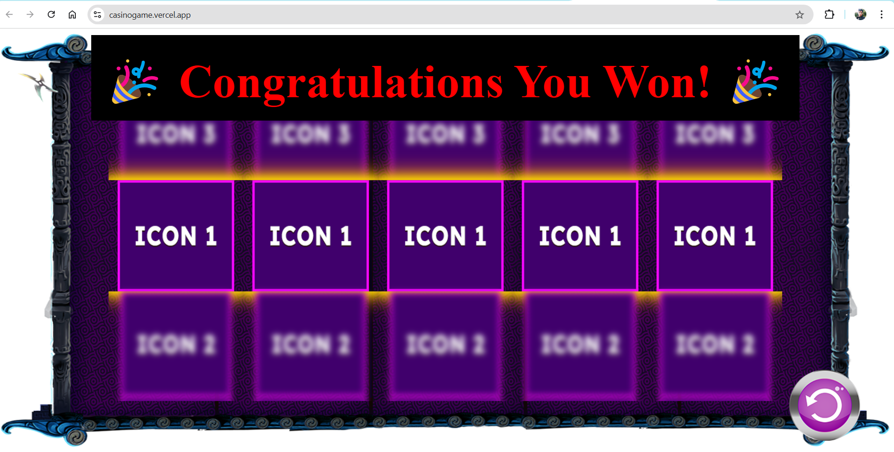

# Casino Game

This is a Casino game project where you can spin the reels and win prizes based on matching icons.

## Screenshots



## Live Demo

You can try the game live here: [Casino Game Demo](https://casinogame.vercel.app/)

## Assignment

- Create a slot of **3x5** with a spin button.
- The **reels icons** should start spinning when the spin button is clicked.
- The behavior of the reel spin should match the attached video.

## Features

- 3x5 Slot Layout.
- Reels spin on button click.
- Winning effects and animations.
- Responsive design to fit various screen sizes.

## Installation

To run the project locally:

1. Clone the repository:
   ```bash
   git clone <repository-url>
   ```
